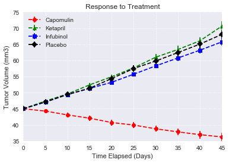
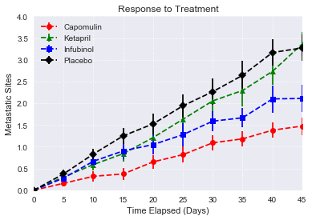
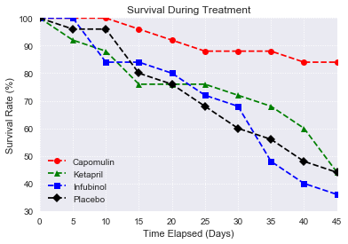
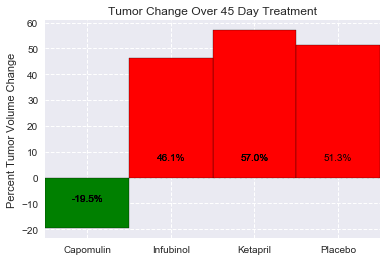

# Pymaceuticals - Analysis

Observed Trend 1: Based on this data, Capomulin seems to be the clear winner in terms of efficacy at reducing tumor size, metastatic sites, and inproving odds of survival.

Observed Trend 2: While Infubinol appears to suppress metastasis, the survival rate of the test group using this drug is the only group with a rate lower than placebo - it seems to be an aggressive drug, the positive outcomes of which do not warrant its use.

Observed Trend 3: Ketapril appears to be borderline dangerous - in the sample given, it delivered survival outcomes roughly equivalent to placebo, and is the only drug which allowed for greater tumor volume and rate of metastasis vs. placebo.


```python
import pandas as pd
import numpy as np
import matplotlib.pyplot as plt
import seaborn as sns
import os

sns.set()
```


```python
clinical_df = pd.read_csv(os.path.join('raw_data','clinicaltrial_data.csv'))
mouse_df = pd.read_csv(os.path.join('raw_data','mouse_drug_data.csv'))
combined_df=clinical_df.merge(mouse_df, on='Mouse ID')

drug_time_gb = combined_df.groupby(['Drug','Timepoint'])

tv_mean_df = pd.DataFrame(drug_time_gb['Tumor Volume (mm3)'].mean())
tv_sem = drug_time_gb['Tumor Volume (mm3)'].sem()

ms_mean_df = pd.DataFrame(drug_time_gb['Metastatic Sites'].mean())
ms_sem = drug_time_gb['Metastatic Sites'].sem()

tv_mean_unstack = tv_mean_df.unstack(0)
ms_mean_unstack = ms_mean_df.unstack(0)

x_axis = tv_mean_unstack.index
```


```python
drugs_to_plot = ['Capomulin','Ketapril','Infubinol','Placebo']
plot_colors = ['red','green','blue','black']
plot_markers = ['o','^','s','D']

tv_mean, tv_mean_ax = plt.subplots()

for i in drugs_to_plot:
    k = drugs_to_plot.index(i)
    tv_mean_ax.errorbar(x_axis, tv_mean_unstack['Tumor Volume (mm3)'][i], yerr=tv_sem[i], marker=plot_markers[k], color=plot_colors[k],
                       linestyle='--', capsize=5,)

tv_mean_ax.set_title('Response to Treatment')
tv_mean_ax.legend()
tv_mean_ax.set_xlim(0, 45)
tv_mean_ax.set_ylim(35, 75)
tv_mean_ax.grid(linestyle=':')
tv_mean_ax.set_ylabel('Tumor Volume (mm3)')
tv_mean_ax.set_xlabel('Time Elapsed (Days)')
```


    Text(0.5,0,'Time Elapsed (Days)')





```python
drugs_to_plot = ['Capomulin','Ketapril','Infubinol','Placebo']
plot_colors = ['red','green','blue','black']
plot_markers = ['o','^','s','D']

ms_mean, ms_mean_ax = plt.subplots()

for i in drugs_to_plot:
    n = drugs_to_plot.index(i)
    ms_mean_ax.errorbar(x_axis, ms_mean_unstack['Metastatic Sites'][i], yerr=ms_sem[i], marker=plot_markers[n], color=plot_colors[n],
                       linestyle='--', capsize=5,)

ms_mean_ax.set_title('Response to Treatment')
ms_mean_ax.legend()
ms_mean_ax.set_xlim(0, 45)
ms_mean_ax.set_ylim(0.0,4.0)
ms_mean_ax.grid(linestyle=':')
ms_mean_ax.set_ylabel('Metastatic Sites')
ms_mean_ax.set_xlabel('Time Elapsed (Days)')
```


    Text(0.5,0,'Time Elapsed (Days)')





```python
survival_rate, sr_ax = plt.subplots()
drugs_to_plot = ['Capomulin','Ketapril','Infubinol','Placebo']
plot_colors = ['red','green','blue','black']
plot_markers = ['o','^','s','D']

survival_rate_pt = pd.pivot_table(combined_df, values='Tumor Volume (mm3)', columns=['Drug'], index=['Timepoint'], aggfunc='count')
select_sr_df = survival_rate_pt[['Capomulin','Ketapril','Infubinol','Placebo']]
 

for i in drugs_to_plot:
    n = drugs_to_plot.index(i)
    sr_ax.errorbar(x_axis, ((select_sr_df[i] / select_sr_df[i][0])*100) , marker=plot_markers[n], color=plot_colors[n],
                       linestyle='--', capsize=5, mec = 'black')


sr_ax.set_title('Survival During Treatment')
sr_ax.legend()
sr_ax.set_xlim(0, 45)
sr_ax.set_ylim(30, 100)
sr_ax.grid(linestyle=':')
sr_ax.set_ylabel('Survival Rate (%)')
sr_ax.set_xlabel('Time Elapsed (Days)')
sr_ax.legend(loc=3)
```


    <matplotlib.legend.Legend at 0x1a1b30e080>





```python
summary_pt = pd.pivot_table(combined_df, values='Tumor Volume (mm3)', columns=['Drug'], index=['Timepoint'], aggfunc='mean')
summary_df = summary_pt[['Capomulin','Ketapril','Infubinol','Placebo']]
summary_pct_list = []
growth_dir = []
pct_labels = []

for i in drugs_to_plot:
    start = summary_df[i][summary_df.index[0]]
    end = summary_df[i][summary_df.index[-1]]
    summary_pct = ((end - start) / start) * 100
    summary_pct_list.append(summary_pct)
    if summary_pct > 0:
        growth_dir.append('red')
    elif summary_pct < 0:
        growth_dir.append('green')
        
summary_fig, summary_ax = plt.subplots()
find_xlim = len(summary_pct_list) -0.5
summary_bar = summary_ax.bar(drugs_to_plot, summary_pct_list, align='center',width=1)


summary_ax.set_ylabel('Percent Tumor Volume Change')
summary_ax.grid(linestyle='--')
summary_ax.set_xlim(-0.5, find_xlim, 1)
summary_ax.set_title('Tumor Change Over 45 Day Treatment')


for i in np.arange(0,len(drugs_to_plot)):
    summary_bar[i].set_color(growth_dir[i])
    summary_bar[i].set_edgecolor('black')
    summary_bar[i].set_label(summary_pct_list[i])
    pct_labels.append(str(summary_pct_list[i].round(1))+'%')
    for bar, label in zip(summary_bar, pct_labels):
        if bar.get_height() > 0:
            height = 6
        elif bar.get_height() < 0:  
            height = -10
        summary_ax.text(bar.get_x() + bar.get_width() / 2, height, label, ha='center', va='bottom', color='black')
    
```




